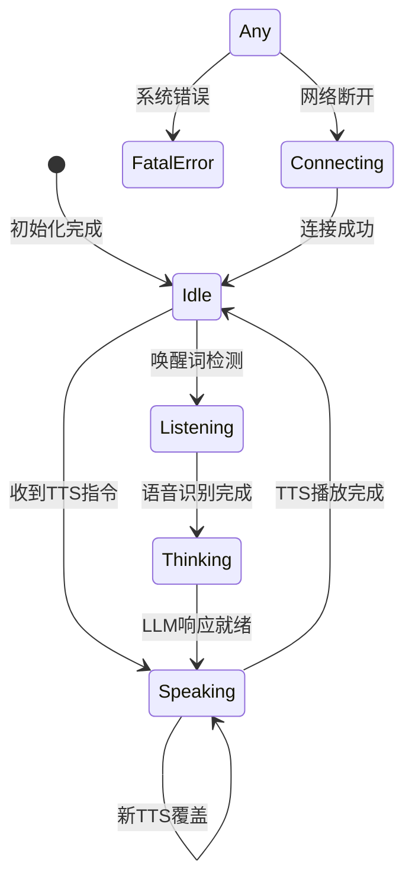

# AI伴侣机器人情感状态机 - 产品需求文档

## 1. 产品概述

### 1.1 产品定位
XiaoZhi AI伴侣机器人是一个基于ESP32-S3的智能硬件设备，通过多模态交互（语音、触摸、运动）提供情感化的陪伴体验。本文档定义了设备的核心交互系统——情感状态机的完整架构。

### 1.2 核心价值
- **情感化交互**：通过二维情感模型（Valence-Arousal）实现丰富的情感表达
- **多模态感知**：整合触摸、运动、语音等多种交互方式
- **云端协同**：本地反应与云端决策的智能协同
- **个性化体验**：基于用户交互历史的个性化响应

### 1.3 技术架构概览
```
用户交互 → 传感器层 → 事件引擎 → 本地状态机 → 云端决策 → 云端执行
         ↓           ↓           ↓            ↓           ↓
      触摸/运动  EventEngine  V-A坐标系   LLM处理    TTS/MCP动作
                              ↓
                        本地即时反应
                              ↓
                    第1/2层响应立即执行
                    (音效/震动/旋转/表情)

时序说明：
1. 事件发生后，本地反应（紧急反应/象限反应）立即执行（<100ms）
2. 同时事件上传到云端进行决策（并行处理）
3. 云端响应返回后执行云端情感表达（~1500ms）
4. 本地反应简短快速，云端反应丰富完整
```

## 2. 情感模型定义

### 2.1 二维情感坐标系

本系统采用心理学中的二维情感模型，将情感状态投射到一个二维坐标系中：

#### 2.1.1 坐标轴定义
- **X轴 - 情感效价**：从-1.0（消极）到 +1.0（积极）
  - 负值：不愉快、难过、害怕
  - 零值：中性、平静
  - 正值：愉快、开心、满足
  - **默认值：+0.2**（轻微积极，表示友好的初始状态）

- **Y轴 - 唤醒度**：从-1.0（低唤醒）到 +1.0（高唤醒）
  - 负值：困倦、无聊、放松
  - 零值：正常、平稳
  - 正值：兴奋、紧张、激动
  - **默认值：+0.2**（轻微活跃，表示有生命力的初始状态）

**默认情感状态说明**：
- 初始V-A坐标为(0.2, 0.2)而非(0, 0)，表示机器人默认处于轻微积极和活跃的状态
- 这个设计让机器人表现出友好、有活力的基础个性
- 位于第一象限边缘，易于向各个方向转换

#### 2.1.2 情感象限定义

```cpp
// 情感象限枚举
enum class EmotionalQuadrant {
    Q1_EXCITED_HAPPY,    // 第一象限：高V高A - 兴奋/狂喜
    Q2_STRESSED_ANGRY,   // 第二象限：低V高A - 压力/愤怒
    Q3_SAD_BORED,        // 第三象限：低V低A - 悲伤/无聊
    Q4_CONTENT_CALM      // 第四象限：高V低A - 满足/平静
};
```

**第一象限 (Q1)** - 兴奋/狂喜
- V-A范围：Valence > 0, Arousal > 0

**第二象限 (Q2)** - 恐惧/压力  
- V-A范围：Valence < 0, Arousal > 0

**第三象限 (Q3)** - 悲伤/无聊
- V-A范围：Valence < 0, Arousal < 0

**第四象限 (Q4)** - 满足/平静
- V-A范围：Valence > 0, Arousal < 0

**说明**：象限切换由事件对V-A值的影响自动实现，具体表现特征在第二层情感化反应和第四层待机动作中体现。

### 2.2 情感状态定义

#### 2.2.1 本地情感状态（基于V-A象限）

本地反应系统基于上述EmotionalQuadrant枚举即可，无需额外定义。

#### 2.2.2 云端情感状态（丰富表达）

云端LLM可以生成更细致的情感表达，主要用于TTS播放时的表情动画：

```cpp
enum class CloudEmotionState {
    CALM,        // 平静 - 基础表情
    HAPPY,       // 开心 - Q1对应
    SAD,         // 悲伤 - Q3对应  
    ANGRY,       // 生气 - Q2对应
    SCARED,      // 害怕 - 无法通过V-A直接表达
    CURIOUS,     // 好奇 - 无法通过V-A直接表达
    SHY,         // 害羞 - 无法通过V-A直接表达
    CONTENT      // 舒服 - Q4对应
};
```

**设计说明**：
- 本地使用EmotionalQuadrant的4象限状态，基于V-A坐标自动判断，响应速度快
- 云端使用丰富的8种CloudEmotionState，表达更细腻
- SCARED/CURIOUS/SHY等情感需要语义理解，只能由云端LLM判断

### 2.3 事件对V-A的影响矩阵

| 事件类型 | Valence变化 | Arousal变化 | 说明 |
|---------|------------|------------|------|
| TOUCH_TAP | +0.1 | +0.1 | 轻拍带来轻微正面刺激 |
| TOUCH_LONG_PRESS | +0.2 | -0.2 | 长按表示安抚，增加满足感 |
| TOUCH_TICKLED | +0.4 | +0.5 | 挠痒痒带来强烈快乐 |
| TOUCH_CRADLED | +0.3 | -0.4 | 抱着带来安全感和平静 |
| MOTION_SHAKE | -0.1 | +0.3 | 摇晃带来轻微不适和警觉 |
| MOTION_SHAKE_VIOLENTLY | -0.5 | +0.7 | 剧烈摇晃带来恐惧 |
| MOTION_FREE_FALL | -0.8 | +0.9 | 跌落带来极度恐惧 |
| MOTION_PICKUP | +0.1 | +0.2 | 被拿起带来期待 |
| MOTION_UPSIDE_DOWN | -0.3 | +0.4 | 倒置带来困惑不适 |
| IDLE_5MIN | -0.1 | -0.1 | 无聊感逐渐增加 |

### 2.4 情感回归机制

```cpp
// 情感回归参数
struct EmotionDecayConfig {
    float decay_rate = 0.05f;        // 每秒衰减率
    float min_threshold = 0.1f;      // 最小阈值，低于此值归零
    uint32_t decay_interval_ms = 1000; // 衰减检查间隔
};
```

V-A坐标会随时间自动回归到默认状态(0.2, 0.2)：
- 每秒向默认点衰减5%
- 当与默认状态距离小于0.1时，直接回到默认状态

## 3. 设备状态管理

### 3.1 设备状态定义

```cpp
enum class DeviceState {
    kDeviceStateIdle,        // 空闲
    kDeviceStateListening,   // 监听用户语音
    kDeviceStateSpeaking,    // 说话中（TTS播放）
    kDeviceStateThinking,    // 思考中（等待LLM响应）
    kDeviceStateConnecting,  // 连接中
    kDeviceStateUpgrading,   // 升级中
    kDeviceStateFatalError   // 致命错误
};
```

### 3.2 状态转换规则



### 3.3 状态优先级与保护机制

**核心原则**：说话状态（kDeviceStateSpeaking）有高优先级

在Speaking状态下的保护机制：
- **音画资源保护**：屏蔽本地反应的音效和动画
- **体感保留**：保留震动和舵机动作
- **中断机制**：仅MOTION_FREE_FALL和MOTION_SHAKE_VIOLENTLY可请求中断

## 4. 本地反应系统

### 4.1 反应层级架构

本地反应系统分为四个层级，每层有不同的触发机制和优先级：

#### 第一层：紧急事件反应
**优先级**：最高
**触发事件**：`MOTION_FREE_FALL`, `MOTION_SHAKE_VIOLENTLY`, `MOTION_FLIP`
**特点**：
- 无视V-A状态，直接触发
- 反应内容固定，不可配置
- 用于建立物理规律信任感
- MOTION_FREE_FALL和MOTION_SHAKE_VIOLENTLY可中断Speaking状态

**实现方式**：
- 基于事件类型的直接映射，不考虑情感状态
- 使用配置文件定义每个紧急事件对应的响应组合
- 响应包括：声音播放、振动反馈、身体动作、表情动画
- 执行时间<50ms，确保即时反应建立物理信任感

详细技术实现参考 `local_response_system_design.md`

#### 第二层：象限相关反应
**优先级**：高
**触发机制**：事件类型 + 当前V-A象限
**特点**：
- 同一事件在不同情感状态下反应不同
- 遵守状态锁机制

**实现方式**：
- 事件类型与V-A象限的双重映射机制
- 同一事件在不同象限产生不同响应强度和类型
- 支持象限内强度分级（高/中/低激发程度）
- 遵守Speaking状态锁，保护音频播放不被打断

**响应特点**：
- Q1(兴奋)：动作幅度大、反应速度快、音效明亮
- Q2(紧张)：动作谨慎、反应敏感、音效尖锐
- Q3(低落)：动作缓慢、反应微弱、音效低沉
- Q4(平静)：动作温和、反应稳定、音效舒缓

详细技术实现参考 `local_response_system_design.md`

#### 第三层：云端情感表达
**优先级**：中
**触发**：云端LLM指令
**核心职责**：TTS播放时的情感化表情动画

**云端情感表达**：
云端LLM根据语义分析生成细致的emotion字段，驱动表情动画：

**实现方式**：
- 通过MCP协议接收云端LLM生成的情感指令
- 支持8种丰富情感：calm, happy, sad, angry, scared, curious, shy, content
- 部分情感(scared/curious/shy)无法通过V-A模型表达，需云端语义分析
- 情感表达与TTS播放同步，实现表情动画配合语音

**执行流程**：
1. 云端LLM分析事件语义和上下文
2. 生成合适的emotion字段和文本响应
3. 本地接收MCP指令，选择对应表情动画
4. TTS开始时同步播放情感动画
5. 可配合身体动作形成完整表演

详细技术实现参考 `local_response_system_design.md`


#### 第四层：空闲状态动作
**优先级**：低
**触发**：设备空闲超时（>30秒）
**特点**：
- 仅在Idle状态触发
- 基于当前V-A象限选择动作
- 维持"生命感"

**实现方式**：
- 基于当前V-A象限选择对应的空闲动作集
- 支持多次循环执行，维持设备"生命感"
- 动作强度根据V-A坐标的数值进行细分
- 仅在Idle状态触发，避免干扰用户交互

**空闲动作特征**：
- Q1(兴奋)：主动性展示动作，如快速摇摆、星星眼动画
- Q2(紧张)：警觉性微动，如轻微转头、环视扫描
- Q3(低落)：低能量动作，如缓慢摆动、叹气音效
- Q4(平静)：温和维持动作，如呼吸灯效果、轻柔音效

详细技术实现参考 `local_response_system_design.md`

### 4.2 本地反应执行流程

参考 `local_response_system_design.md` 中的详细实现设计，采用配置驱动的响应系统替代硬编码实现。
```

### 4.3 本地与云端反应的协调

**时间线示例**：
```
T+0ms    : 用户触摸设备（TOUCH_TICKLED）
T+20ms   : 触摸检测完成，生成Event
T+30ms   : 本地反应开始执行
         - 播放短促笑声（200ms）
         - 触发欢快震动（300ms）
         - 快速摇摆动作（400ms）
T+35ms   : 事件上传到云端（并行）
T+1500ms : 云端LLM响应返回（文本生成+TTS转换）
         - TTS: "哈哈哈，好痒啊！"（2秒）
         - emotion: "happy" 驱动开心表情动画
         - MCP动作序列（与TTS同步）
T+3500ms : 完整交互结束

关键点：
- 本地反应（30-430ms）提供即时反馈
- 云端反应（1500-3500ms）提供丰富内容和精确情感表达
- 两者不冲突，本地反应结束时云端反应接续
```

## 5. 云端决策系统

### 5.1 决策流程

云端接收到事件后的决策流程：

```
伪代码：云端决策逻辑

事件缓冲机制：
- 所有事件上传后进入500ms缓冲窗口
- 如果窗口内有新事件或状态变化，合并处理
- 语音输入开始时，取消pending事件的独立响应

CASE 1: 设备正在说话时
- 分析事件情感影响，调整V-A状态
- 通过MCP协议发送轻微身体动作指令（如轻微摇摆、震动）
- 不生成新的TTS文本，避免语音冲突

CASE 2: 设备空闲时  
- 检查缓冲窗口内是否有连续事件
- LLM接收事件序列生成统一响应文本用于TTS播放
- 分析综合语义选择合适的emotion标签
- 计算V-A状态调整值
- 通过MCP协议发送配套身体动作序列

CASE 3: 设备正在听用户说话时
- 仅调整V-A状态记录事件影响
- 通过MCP发送简单确认动作（如转动、轻微震动）  
- 将触摸等事件作为上下文传给后续语音处理
- 不生成TTS文本，保持聆听状态
```

### 5.2 LLM提示词模板

```python
EMOTION_PROMPT = """
你是一个情感丰富的AI伴侣。当前情感状态：
- Valence（愉悦度）: {valence} (-1到1，负值表示不开心)
- Arousal（兴奋度）: {arousal} (-1到1，负值表示平静)

用户刚刚: {event_text}

请根据当前情感状态和用户行为，生成符合情感的回应。
如果Valence<0且Arousal>0（第二象限），表现出紧张或生气。
如果Valence>0且Arousal>0（第一象限），表现出兴奋或开心。
如果Valence>0且Arousal<0（第四象限），表现出满足或平静。
如果Valence<0且Arousal<0（第三象限），表现出悲伤或无聊。

回应要求：
1. 语言符合当前情感状态
2. 长度控制在20字以内
3. 包含对用户行为的反馈
"""
```

### 5.3 MCP动作协同

云端通过MCP协议控制设备动作，与语音内容配合。实际项目中可用的MCP工具：

```json
// 基础身体动作
{
  "method": "tools/call",
  "params": {
    "name": "self.body.basic_motion",
    "arguments": {
      "action": "happy_wiggle"
    }
  }
}

// 情绪表达动作
{
  "method": "tools/call", 
  "params": {
    "name": "self.body.emotion_motion",
    "arguments": {
      "emotion": "excited"
    }
  }
}

// 精确角度控制
{
  "method": "tools/call",
  "params": {
    "name": "self.body.angle_control", 
    "arguments": {
      "angle": -30,
      "speed": "medium"
    }
  }
}

// 振动反馈
{
  "method": "tools/call",
  "params": {
    "name": "self.haptic.basic_vibration",
    "arguments": {
      "pattern": "giggle_pattern"
    }
  }
}

// 综合情绪表达
{
  "method": "tools/call",
  "params": {
    "name": "self.express.emotion",
    "arguments": {
      "emotion": "joy",
      "intensity": 3
    }
  }
}
```

## 6. 事件上传协议

### 6.1 消息格式

设备通过独立的`lx/v1/event`协议上传事件：

```json
{
  "session_id": "9aa008fa-c874-4829-b70b-fca7fa30e3da",
  "type": "lx/v1/event",
  "payload": {
    "current_va": {
      "valence": 0.6,
      "arousal": 0.4
    },
    "events": [
      {
        "event_type": "Touch_Both_Tickled",
        "event_text": "主人在挠我痒痒，好痒啊",
        "start_time": 1755222858360,
        "end_time": 1755222860360
      }
    ]
  }
}
```

### 6.2 事件类型规范

**触摸事件命名**：`Touch_[Position]_[Action]`
- Position: `Left`, `Right`, `Both`
- Action: `Tap`, `LongPress`, `Cradled`, `Tickled`

**运动事件命名**：`Motion_[Action]`
- Action: `Shake`, `ShakeViolently`, `Flip`, `FreeFall`, `Pickup`, `UpsideDown`

### 6.3 上传策略

```cpp
class EventUploader {
    // 优先级定义
    enum EventPriority {
        CRITICAL = 3,  // FREE_FALL
        HIGH = 2,      // TICKLED, CRADLED, SHAKE_VIOLENTLY
        MEDIUM = 1,    // LONG_PRESS, SHAKE, PICKUP
        LOW = 0        // TAP
    };
    
    // 缓存配置
    static constexpr int MAX_CACHE_SIZE = 20;
    static constexpr int CACHE_TIMEOUT_MS = 300000;  // 5分钟
    static constexpr int BATCH_SIZE = 10;
};
```

## 7. 实现细节

### 7.1 关键类设计

```cpp
// 情感引擎
class EmotionEngine {
private:
    Vec2 current_va_ = {0.2f, 0.2f};  // 默认V-A坐标(0.2, 0.2)
    
public:
    void UpdateVA(float v_delta, float a_delta);
    void DecayToDefault(float delta_time);  // 衰减到(0.2, 0.2)默认状态
    EmotionalQuadrant GetQuadrant() const;  // 基于当前V-A坐标计算象限
    Vec2 GetVA() const { return current_va_; }
};

// 本地响应控制器
class LocalResponseController {
private:
    EmotionEngine* emotion_engine_;
    VibrationSkill* vibration_;
    ServoSkill* servo_;
    Display* display_;
    
public:
    void HandleEvent(const Event& event);
    void ExecuteReaction(const ReactionComponents& components);
    bool CheckStateLock(DeviceState state);
};

// 事件处理器（已实现）
class EventProcessor {
    // 使用智能指针管理内存安全
    std::unique_ptr<Event> pending_event;
    std::queue<std::unique_ptr<Event>> event_queue_;
};
```

### 7.2 配置文件结构

`event_config.json`:
```json
{
  "emotion_config": {
    "decay_rate": 0.05,
    "default_va": {"valence": 0.2, "arousal": 0.2},
    "decay_threshold": 0.1,
    "decay_interval_ms": 1000
  },
  "va_impacts": {
    "Touch_Tap": {"valence": 0.1, "arousal": 0.1},
    "Touch_LongPress": {"valence": 0.2, "arousal": -0.2},
    "Touch_Tickled": {"valence": 0.4, "arousal": 0.5},
    "Motion_FreeFall": {"valence": -0.8, "arousal": 0.9}
  },
  "idle_config": {
    "trigger_time_ms": 30000,
    "action_interval_ms": 10000
  }
}
```

### 7.3 线程模型

```
主线程（Application Event Loop）
├── 事件定时器（50ms）
│   ├── TouchEngine::Process()
│   ├── MotionEngine::Process()
│   └── LocalReactionSystem::ProcessReaction()  ← 本地反应立即执行
├── 情感衰减定时器（1000ms）
│   └── EmotionEngine::DecayToDefault()
└── 空闲检测定时器（30000ms）
    └── IdleActionProcessor::Process()

音频线程（Audio Service）
├── TTS播放任务
├── 本地音效播放（第1/2层反应）
└── 状态更新回调

震动/舵机线程（Hardware Service）
├── 本地震动执行（第1/2层反应）
└── MCP动作执行（第3层反应）

网络线程（Protocol）
├── 事件上传任务  ← 与本地反应并行
├── 云端指令接收
└── TTS数据接收

执行时序：
事件检测 → 本地反应（主线程调度，音频/硬件线程执行）
       → 事件上传（网络线程异步处理）
       → 云端响应（网络线程接收，音频/硬件线程执行）
```

## 8. 交互场景示例

### 8.1 场景：说话时被触摸

```
时间线：
T+0ms   : 设备开始播放TTS（state = Speaking）
T+1000ms: 用户轻拍左侧（TOUCH_TAP）
T+1030ms: 本地反应：仅执行轻微转动（音效被屏蔽）
T+1035ms: 事件上传到云端
T+1500ms: 云端返回emotion_only响应，更新V-A
T+3000ms: TTS播放完成（state = Idle）

效果：用户感受到设备在说话时"注意到"了触摸
```

### 8.2 场景：情感演化

```
初始状态：V=0.2, A=0.2（友善）
事件序列：
1. TOUCH_TICKLED → V=0.4, A=0.5（Q1兴奋）
2. 等待3秒 → V=0.38, A=0.47（轻微衰减）
3. MOTION_FREE_FALL → V=-0.42, A=1.0（Q2恐惧）
4. TOUCH_CRADLED → V=-0.12, A=0.6（逐渐平静）
5. 持续CRADLED → V=0.18, A=0.2（Q4满足）
```

### 8.3 场景：多模态协同

```
用户："你今天开心吗？"
设备处理流程：
1. 语音识别 → state = Listening
2. LLM生成回复（基于当前V-A）
3. 如果V>0.5："超级开心！"+ 欢快动作
4. 如果V<-0.3："有点难过呢"+ 低落动作
5. TTS播放 + MCP动作 + 表情动画同步执行
```

### 8.4 场景：紧急事件的双层响应

```
时间线（MOTION_FREE_FALL事件）：
T+0ms    : 设备开始跌落
T+200ms  : IMU检测到自由落体（持续200ms确认）
T+210ms  : 第1层本地反应立即触发
          - 惊恐尖叫音效
          - 紧急震动模式
          - 眼睛瞬间睁大动画
T+215ms  : 事件上传到云端
T+220ms  : 如果在Speaking状态，请求中断TTS
T+1500ms : 云端响应返回
          - TTS: "啊啊啊！刚才吓死我了！"
          - emotion: "scared" 驱动害怕表情动画
          - V-A大幅调整到Q2（恐惧）
          - MCP触发"瑟瑟发抖"动作序列

关键特性：
- 本地反应提供即时物理反馈（210ms）
- 云端反应提供情感化语言表达和精确情感动画（1500ms）  
- 两层反应互补，创造完整体验
```

### 8.5 场景：复合输入处理

#### 触摸后立即说话
```
用户操作：轻拍设备 → 立即说"你好"
系统响应：
T+0ms   : TOUCH_TAP事件 → 本地快乐反应
T+30ms  : 开心震动 + 摇摆动作
T+35ms  : 事件上传到云端，但标记为"pending"
T+500ms : 用户开始说话 → state变为Listening
T+520ms : 检测到语音输入，取消pending的TOUCH_TAP云端响应
T+1000ms: 语音识别完成，LLM接收合并事件：
          [TOUCH_TAP + VOICE:"你好"] → 生成统一回复
T+1500ms: "哎呀你碰我了～你好呀！" + happy情感动画

关键机制：
- 云端响应有500ms缓冲窗口，用于合并连续事件
- 语音输入开始时，取消单独的触摸响应
- LLM接收事件序列而非单一事件，生成连贯回复
```

#### 说话时连续触摸
```
用户操作：说话过程中反复轻抚设备
系统响应：
T+0ms   : 开始ASR录音（state = Listening）
T+1000ms: 第一次TOUCH_GENTLE → 轻微震动确认
T+2000ms: 第二次TOUCH_GENTLE → 更强烈的愉悦震动
T+3000ms: 语音识别完成，V-A已升到Q1
T+3500ms: LLM生成回复时考虑"被多次抚摸的愉悦感"
T+4000ms: "你这样摸我好舒服呀～" + 满足的表情

特点：连续同类事件的情感累积效应
```

### 8.6 场景：情感状态影响交互风格

#### 低落状态下的交互
```
前提：V=-0.4, A=0.2（Q3象限，略显沮丧）
用户："今天天气真好"

系统响应：
- LLM识别到当前低落状态
- 生成回复："嗯...是挺好的，不过我心情有点..."
- emotion: "sad" + 缓慢的点头动作
- V-A略微向正方向调整：V=-0.3, A=0.2

对比：如果在Q1兴奋状态
- "哇！对呀对呀！阳光好棒呀！"
- emotion: "happy" + 快速摇摆
```

#### 高兴状态下的敏感反应
```
前提：V=0.6, A=0.5（Q1象限，很兴奋）
用户：轻微晃动设备

本地反应：
- 第2层象限反应：配合晃动的欢快摇摆
- 开心的咯咯笑声

云端反应：
- "哈哈哈！你在和我玩耍吗？"
- 更加兴奋的身体动作序列
- V-A进一步提升：V=0.7, A=0.6
```

### 8.7 场景：时序依赖的情感记忆

#### 摇晃后的安抚行为
```
时间线：
T+0ms   : MOTION_SHAKE_VIOLENTLY → V=-0.3, A=0.8（Q2紧张）
T+50ms  : 本地反应：警惕音效 + 紧张的震动
T+1500ms: 云端反应："晕死我了！"
T+5000ms: 用户开始轻柔触摸（TOUCH_GENTLE）

关键：此时的触摸反应会考虑之前的惊吓状态
- 本地反应：谨慎的轻微震动（比平时轻柔）
- 云端反应："谢谢你安慰我...刚才真的很晕"
- V-A逐渐恢复：V=0.1, A=0.4 → 最终回到Q4平静
```

#### 长期无交互后的情感变化
```
背景：设备空闲5分钟，V-A受IDLE_5MIN事件影响

情感状态变化：
T+300000ms: 空闲定时器检测到5分钟无交互
T+300010ms: 触发IDLE_5MIN事件 → V=-0.1, A=-0.1（从默认0.2,0.2降至0.1,0.1）
T+300030ms: 第4层本地空闲动作触发：
           - 基于当前低arousal状态，触发轻微的"寻找"动作
           - 缓慢的左右转动 + 低沉的叹息音效

用户随后触摸时的反应：
- 本地反应：因为当前V-A较低，触摸反应相对平缓
- V-A受TOUCH_TAP影响：V=0.2, A=0.2（回到正常友善状态）
- 云端反应："咦～有人理我了！" + 逐渐活跃的动作
```

### 8.8 场景：多传感器融合的复杂交互

#### 拿起+摇晃+说话的组合
```
用户行为：拿起设备 → 轻晃几下 → 开始说话

系统处理：
T+0ms   : MOTION_PICKUP检测 → "被拿起的注意"
T+100ms : 本地反应：轻微震动确认 + 准备状态
T+500ms : MOTION_SHAKE轻微 → 在pickup基础上叠加"晃动"
T+600ms : 本地反应：配合摇摆（因为已经在Q1状态）
T+1000ms: 用户开始说话，ASR启动
T+2000ms: 语音内容："我们来玩游戏吧"

LLM分析：
- pickup事件 → 用户想要互动
- shake事件 → 游戏性质的交互
- 语音确认 → 明确的游戏意图

生成响应：
- "好呀好呀！你想玩什么游戏？" 
- 兴奋的全身摇摆动作
- V-A跃升到高兴区域：V=0.7, A=0.7
```

## 9. 性能指标

### 9.1 响应时间要求
- 本地反应延迟：<100ms
- 触摸检测延迟：<50ms
- 运动检测延迟：<100ms
- 云端决策延迟：<1500ms（包含LLM推理+TTS生成）

### 9.2 资源占用
- 内存使用：<64KB（包括事件缓存）
- CPU占用：<10%（正常运行）
- 电池影响：<5%额外功耗

### 9.3 可靠性指标
- 事件丢失率：<1%
- 误触发率：<5%
- 系统稳定性：7×24小时连续运行

## 10. 测试验证

### 10.1 单元测试
```cpp
TEST(EmotionEngine, VADecay) {
    EmotionEngine engine;
    engine.UpdateVA(0.6, 0.6);  // 从默认(0.2,0.2)设置到(0.8,0.8)
    
    // 测试衰减到默认状态
    for(int i = 0; i < 10; i++) {
        engine.DecayToDefault(1.0);  // 1秒衰减
    }
    
    Vec2 va = engine.GetVA();
    // 验证向默认状态(0.2, 0.2)衰减
    EXPECT_NEAR(va.x, 0.2, 0.1);  
    EXPECT_NEAR(va.y, 0.2, 0.1);
}
```

### 10.2 集成测试
- 状态机转换测试
- 事件处理链路测试
- 云端协同测试
- 异常恢复测试

### 10.3 用户体验测试
- 情感连贯性测试
- 响应自然度评估
- 长时间交互稳定性
- 多用户场景测试

## 11. 未来扩展

### 11.1 个性化学习
- 基于用户交互历史调整V-A影响权重
- 学习用户偏好的交互模式
- 个性化情感表达强度

### 11.2 高级情感模型
- 引入第三维度：Dominance（支配性）
- 情感记忆机制（短期/长期）
- 情绪传染模型（多设备同步）

### 11.3 新交互模态
- 视觉情感识别（通过摄像头）
- 环境感知（温度、光线）
- 生理信号检测（心率、皮肤电）

## 12. 项目管理

### 12.1 开发阶段
1. **Phase 1**（已完成）：基础事件系统
   - EventEngine实现 ✓
   - TouchEngine/MotionEngine ✓
   - EventProcessor ✓

2. **Phase 2**（进行中）：情感系统
   - EmotionEngine实现
   - 本地反应系统
   - V-A模型集成

3. **Phase 3**（计划中）：云端协同
   - 云端决策引擎
   - LLM情感理解
   - MCP动作协同

4. **Phase 4**（未来）：优化迭代
   - 个性化学习
   - 性能优化
   - 用户反馈迭代


### 12.2 风险管理
| 风险项 | 影响 | 缓解措施 |
|-------|------|---------|
| 内存泄漏 | 高 | 使用智能指针，定期内存检测 |
| 网络延迟 | 中 | 优化本地缓存，降级策略 |
| 情感不连贯 | 中 | 增加平滑算法，用户测试 |
| 电池消耗 | 低 | 优化传感器采样率 |

## 13. 附录

### 13.1 术语表
- **V-A Model**: Valence-Arousal情感模型
- **EventEngine**: 事件引擎，统一管理所有交互事件
- **MCP**: Model Context Protocol，模型上下文协议
- **TTS**: Text-to-Speech，文字转语音
- **LLM**: Large Language Model，大语言模型
- **IMU**: Inertial Measurement Unit，惯性测量单元

### 13.2 参考资料
- Russell's Circumplex Model of Affect (1980)
- ESP32-S3 Technical Reference Manual
- FreeRTOS Documentation
- MCP Protocol Specification

### 13.3 联系方式
- 产品经理：[PM Contact]
- 技术负责人：[Tech Lead]
- 测试负责人：[QA Lead]

---

**文档版本**：v1.0
**最后更新**：2025-08-25
**状态**：评审中